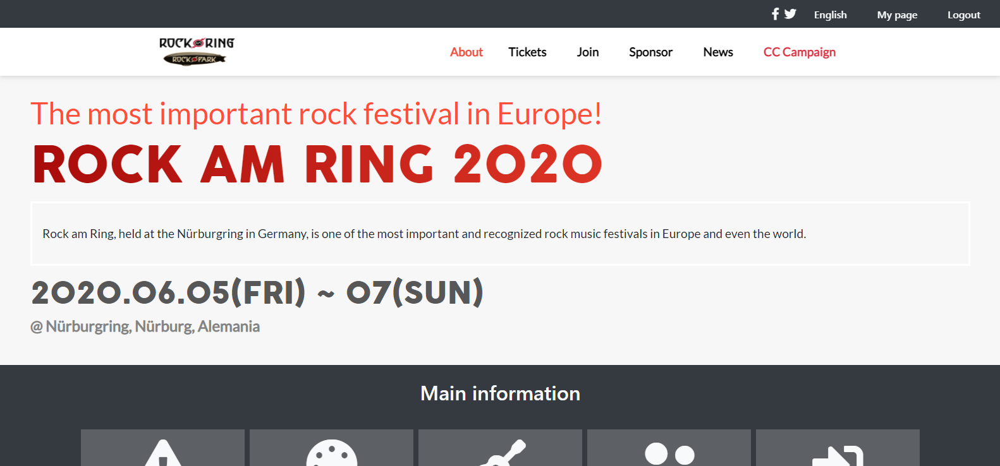
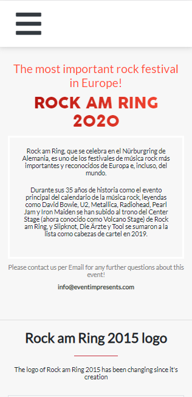
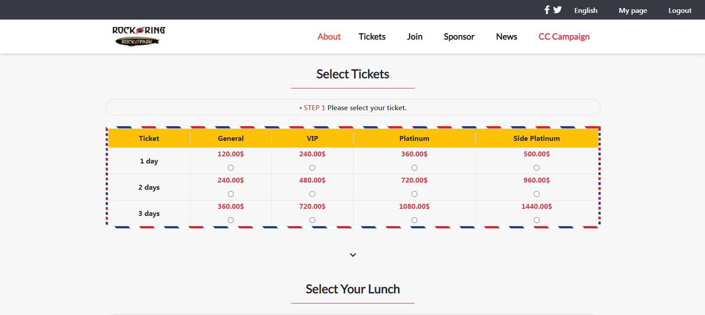

# Capstone-Project

This project was created to give the user a more responsive design with different screen sizes, from mobile version to desktop version, it contains a Home page, where you are going to be able to see all the main information, an about page, where you can see the details of the company, and a tickets page, where you are going to be able to choose between some options to buy some products of the company.

In this case, I tried to follow all the guidelines given, including typographies, icons, and layout.

## Built With

- HTML & CSS

## Live Demo

[Live Demo Link](https://marcosmerida.github.io/Capstone-Project/)

## Instalation

To get a local copy up and running follow these simple example steps.
- Open terminal
- Clone this project by command git clone https://github.com/marcosmerida/Capstone-Project/tree/Test
- cd capstone-project folder
- Open index.html in browser

## Getting Started 
- Index.html is the main marke up that will show as the first page in the browser .
- In styles folder you will find the css files that contain all applicated designing on this project .
- resources folder contain most of pictures that has been in use for this project

### Prerequisites

- IDE to edit and run the code (We've used Visual Studio Code 🔥).

### Usage

- For anyone who wants to practice HTML5 and Bootstrap responsive design.
- How to apply responsive desing using Bootstrap and good practices.

## Authors

👤 **Juan Marcos Mérida**

- GitHub: [@githubhandle](https://github.com/marcosmerida)
- LinkedIn: [LinkedIn](https://linkedin.com/in/marcos-merida-219437206/)

## Acknowledgment

The original page and design is a creation of Cindy Shin. 
[Original page Link](https://www.behance.net/gallery/29845175/CC-Global-Summit-2015)

## Show your support

Give a ⭐️ if you like this project!
