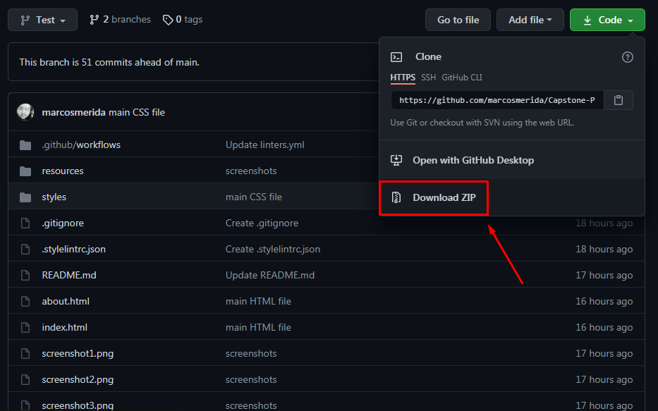
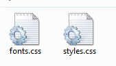
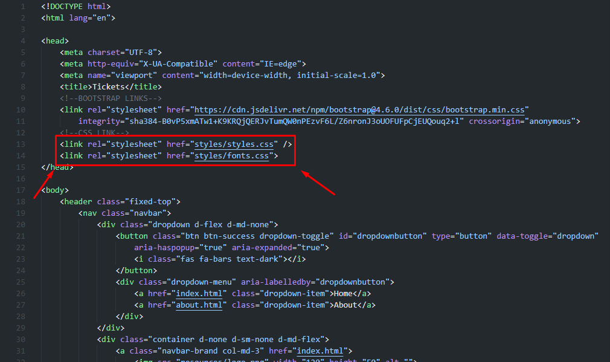

# Capstone-Project

This project was created with the objetive of giving the user a more responsive design with different screen sizes, from movile version to desktop version, it contains a Home page, where you are going to be able to see all the main information, an about page, where you can see the details of the company, and a tickets page, where you are going to be able to choose between some options in order to buy some products of the company.

In this case i tried to follow all the guidelines given, including typographies, icons and layout.

## Built With

- HTML & CSS

## Live Demo

[Live Demo Link](https://marcosmerida.github.io/Capstone-Project/)

## Instalation

1. Download de files

 

2. Please locate these two files that are inside of the file called "syles"
 

3. Now please open the files index.html, about.html and tickets.html in your code editor and make sure that these files are linked in the corresponding section.

## Authors

👤 **Juan Marcos Mérida**

- GitHub: [@githubhandle](https://github.com/marcosmerida)
- LinkedIn: [LinkedIn](https://linkedin.com/in/marcos-merida-219437206/)

## Show your support

Give a ⭐️ if you like this project!
