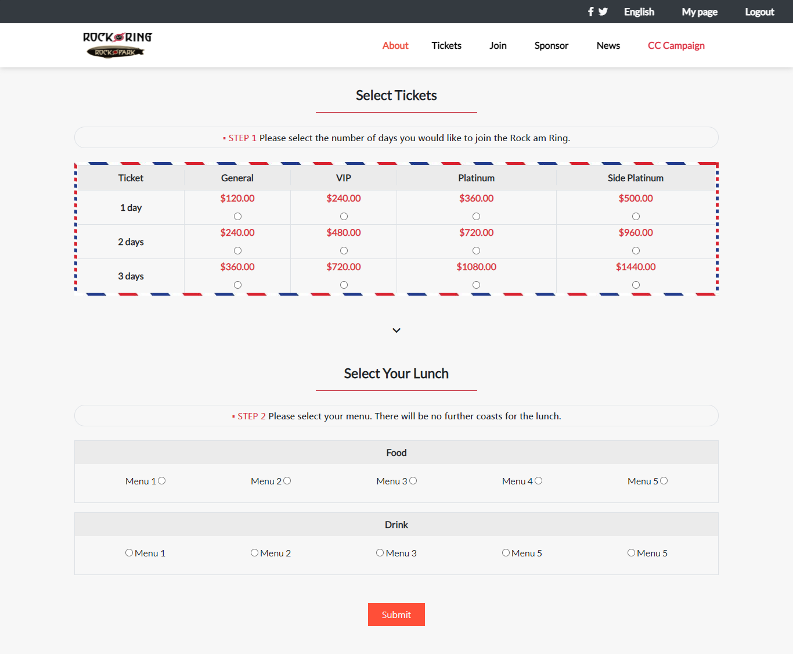

# Capstone-Project

This project was created with the objetive of giving the user a more responsive design with different screen sizes, from movile version to desktop version, it contains a Home page, where you are going to be able to see all the main information, an about page, where you can see the details of the company, and a tickets page, where you are going to be able to choose between some options in order to buy some products of the company.

In this case i tried to follow all the guidelines given, including typographies, icons and layout.




## Built With

- HTML & CSS

## Live Demo

[Live Demo Link](https://marcosmerida.github.io/Capstone-Project/)

## Instalation

1. Clone the repo
   ```sh
   git clone https://github.com/marcosmerida/New-York-Times-article-Project.git
   ```
2. Make sure that the images inside the /resources file are linked in the index.html

3. Link the files style.css and fonts.css into the HTML file.

## Authors

👤 **Juan Marcos Mérida**

- GitHub: [@githubhandle](https://github.com/marcosmerida)
- LinkedIn: [LinkedIn](https://linkedin.com/in/marcos-merida-219437206/)

## Show your support

Give a ⭐️ if you like this project!
